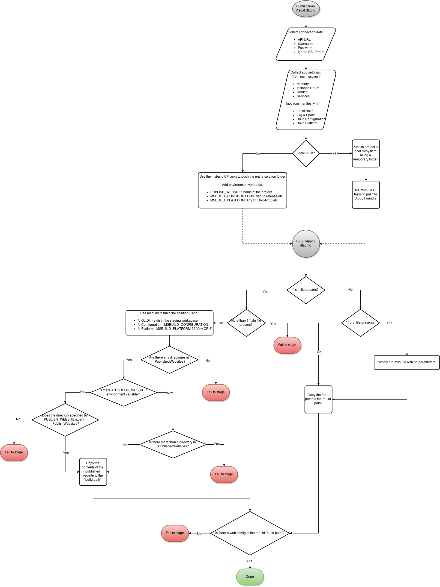

Visual Studio Extension
===


##Cloud Foundry Explorer

###Tree View

Node types:

- `CloudFoundryTarget`
 - actions: refresh, remove    
 - details: version, url, username, ignore ssl errors
- `Organization`
 - actions: refresh
 - details: current roles in org, org name, when it was created
- `Space`
 - actions: refresh
 - details: current roles in space, space name, when it was created
- `AppsCollection`
 - actions: refresh
- `App`
 - actions: browse, start, restart, stop, delete
 - details:  when it was created, name, buildpack, max memory, instance count
- `Service`
 - actions: start, restart, stop, delete
 - details: current roles in org, org name, when it was created
- `Route`
 - actions: delete
 - details: domain for route, apps bound to route
- `AppFiles`
 - actions: refresh
 - details: N/A
- `File`
 - action: open
 - details: filename
- `ServicesCollection`
 - action: refresh
 - details
- `RoutesCollection`
 - action: refresh
 - details

Special node types
- `CloudError`
- `LoadingPlaceholder`
```
├── my-cf-target1
│   ├── Organization1
│   │   ├── dev-space
│   │   │   ├── Apps
│   │   │   │   ├── my-asp.net-app
│   │   │   │   │   └── Files
│   │   │   │   │       ├── default.aspx
│   │   │   │   │       └── web.config
                        Services
                        Routes
                        *Logs
│   │   │   │   ├── my-php-app
│   │   │   │   └── my-ruby-app
│   │   │   ├── Routes
│   │   │   │   ├── aspapp
│   │   │   │   └── rubyapp
│   │   │   └── Services
│   │   │       ├── my-mssql-service
│   │   │       └── my-mysql-service
│   │   ├── prod-space
│   │   └── test-space
│   ├── Organization2
│   └── Organization3
        Buildpacks
        Services
└── my-cf-target2
```

###Details View


##Project Publish

###Flow




###Enabling a project to be published

A project being enabled to be pushed means it is configured to use the Cloud Foundry `msbuild` publish targets.
One can interact with the nuget system using [NuGet Services](https://docs.nuget.org/create/invoking-nuget-services-from-inside-visual-studio).
The interface will allow the user to configure a project to be published using  a button in the property pages.

###Configuring project's CF publish configuration

Use msbuild config for project
https://msdn.microsoft.com/en-us/library/bb165747.aspx
